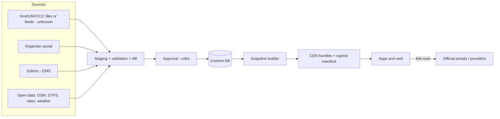

# Phase 12 — Data & Integration Strategy (draft v1, 2026-10-03)
Rule from the project brief: **never assume an API exists.** Every integration below is labelled **Confirmed** (evidence found), **Unknown** (not found / not asked yet) or **None** (we should not integrate). Every integration has a manual fallback, so no feature depends on an external feed to ship.
Inputs: reality check, COP32 context, benchmarks, IA, flows, architecture (D17/D18), prioritisation (D15). Approved today: D17 (reference architecture), D18 (framework by spike).

## 1. Principles (proposed D19)
1. **No hard dependency.** Each integration has a documented manual path (CSV/spreadsheet/CMS entry or a plain link). The product must work with zero external feeds.
2. **Adapters behind an interface.** Each source is read through an adapter that normalises into our event-agnostic model (`event_id` on everything). Replacing a source never changes the app.
3. **Staging → validation → approval → publish.** Imported data never goes live directly; changes are diffed, validated (required fields, language pair, time zone), approved (roles per Phase 16) and then built into snapshots.
4. **Provenance on every record:** source, source URL, licence, imported-at, last-verified, approver. This drives the verified-source label (INF-10).
5. **Licence-aware:** open data (OSM/ODbL, GTFS, CC-BY) recorded with attribution requirements; no copying of official content without permission; **no scraping of official sites without written permission** (terms-of-use and relationship risk).
6. **Link, don't copy** for official documents, streams, bookings and visas (D14).
7. **Personal data stays out of integrations** by default (D17); outbound link-outs carry no user identifiers.

## 2. Data inventory and classification
| Data class | Examples | Personal data? | Where | Owner (proposed) | Retention (proposed; confirm in Phase 13) |
|---|---|---|---|---|---|
| Public content | Programme, speakers (public bios), venues, POIs, guides, news, FAQs, link-out registry, alerts | No (speaker names/photos are public-figure data — confirm consent/legal basis) | CMS DB → snapshots on CDN | Event owner (host/government); editorial by operator | Permanent per event (archive) |
| Reference/open data | OSM extracts, GTFS routes, exchange-rate snapshots, weather | No | Derived datasets in our DB/tiles | Original publishers (licences) | Refreshed; history optional |
| Operational data | Moderation queue, audit log, import logs | Staff identifiers only | Ethiopia | Operator/owner | Audit log long-term (policy); logs 90 days (proposal) |
| Account data (optional) | Email/phone for one-time codes, language, role, consents | **Yes** | Ethiopia (personal-data plane) | Controller (see §6) | Until deletion; inactive accounts purged after a stated period (proposal 12 months) |
| Device/notification data | Push tokens, platform, language, topics | **Yes** (device identifier) | Ethiopia | Controller | Until unsubscribe; purge stale tokens (proposal 90 days of failures) |
| User-generated (organiser/volunteer) | Organiser submissions, volunteer profiles | Yes (contacts) | Ethiopia | Controller | Event + archive policy |
| Device-local data | Saved sessions, favourites, offline packs, preferences | On the device only | Device | User | User-controlled |
| Aggregate analytics | Counts of views/saves by item, by language/country (coarse) | Designed to be non-personal | Self-hosted, Ethiopia | Operator → owner | 24 months aggregates (proposal); no raw per-user events |
| Consent records | Consent versions/timestamps | Yes | Ethiopia | Controller | Life of account + legal period |

Sensitive data (health, biometrics, political opinion, children's data) is **not collected**; emergency/medical content is informational only. Minors: the Proclamation prohibits marketing/profiling of minors (Art. 11(4)) — no profiling, no ads.

## 3. Integration register
Columns: **Purpose · Data owner · API availability · Format · Auth · Update frequency · Dependency risk · Fallback · Release**. Evidence in source register.

### 3.1 Event data (host / UNFCCC / organisers)
| ID | Integration | Purpose | Data owner | API availability | Format | Auth | Update freq | Dependency risk | Fallback | Release |
|---|---|---|---|---|---|---|---|---|---|---|
| E1 | Official COP32 programme & schedule | Sessions, rooms, times | COP32 Presidency Secretariat / UNFCCC | **Unknown.** Past COPs publish schedules as web pages and PDFs (UNFCCC "meetings at a glance", daily programme published the night before; updates can lag ~15 min); **no API/RSS/JSON found** | PDF/HTML (past COPs); ICS/JSON/CSV if requested | Unknown | Daily or more during the event | **High** (central to the product) | Request a structured export (CSV/ICS/JSON) in writing from Secretariat; else staff keep a spreadsheet and import; link-outs to official programme pages | Pilot (sample) / Event (real) |
| E2 | Side-event / pavilion applications and listings | Side-event directory | Host (applications) + organisers | **Unknown** (ACS2 received 700+ applications for 300+ slots — a system exists for such events) | Unknown | Unknown | Daily | High | Organiser self-service portal (our own; EXH-02) as a parallel source; spreadsheet import | Event |
| E3 | Speaker/exhibitor data | Directories | Organisers / host | Unknown | Unknown | — | Weekly→daily | Medium | Organiser portal; manual entry; public bios with consent | Pilot/Event |
| E4 | Venue plans & accessibility info | Maps, rooms, step-free routes | Host / venue operator | **Unknown** (no venue announced) | CAD/PDF/GeoJSON if available | — | Rare | High for NAV-01/09 | Trace published plans manually; map the venue on OSM; "TBC" states | Event |
| E5 | Registration / accreditation (UNFCCC ORS) | Not integrated | UNFCCC | None for third parties | — | — | — | — | Link-out guidance only (INF-02) | Demo |
| E6 | Official live streams & recordings | Live & recorded (MED-01/02) | UNFCCC (UN Web TV / UNFCCC webcast) / host | **Unknown** for embedding; past COPs have public webcast archives | Links / embed URLs | None for public links | Real-time | Medium | Link-out; click-to-load embed only if permitted | Event |
| E7 | Official documents | Library | UNFCCC / host | Pages exist; API **Unknown** | PDF/HTML | None | Continuous | Low | Curated links with source label; no re-hosting without permission | Pilot |
| E8 | Official announcements / press releases | News/Updates | Host press office, Government Communication Service, ENA/Fana | **Unknown** (RSS/feeds not verified) | HTML/RSS | None | Continuous | Medium | Editors summarise with links; request press distribution list/API | Pilot |
| E9 | Host-provided alerts (safety, closures) | Alerts (NOT-03) | Host operations / security | **Unknown** | Unknown | — | Real-time | **High** for safety | Operator publishes alerts from authorised sources only (dual approval) | Event |
| E10 | Volunteer programme data | Volunteer mode | Volunteer programme owner | Unknown | — | — | — | Low-Med | Static FAQ + invite code; no shift data | Event |

### 3.2 City, travel and visit-planning data
| ID | Integration | Purpose | Data owner | API availability | Format | Auth | Update freq | Dependency risk | Fallback | Release |
|---|---|---|---|---|---|---|---|---|---|---|
| T1 | E-visa (evisa.gov.et) | Visa guide + official application | Ethiopian Immigration authorities | **None** (no API needed) — official portal | Web | — | — | Low | Link-out via interstitial; static guide with last-verified date; embassy contact | Demo |
| T2 | Flights (airlines/booking) | Booking link-out | Airlines | **Confirmed** options exist for partners (Ethiopian Airlines NDC API, an affiliate programme via CJ, third-party aggregators) — **not needed for link-out** | URL | — | — | Low | Neutral links list; affiliate decisions in Phase 17 | Pilot |
| T3 | Accommodation | Stay guide + link-outs | Host (official platform?) / hotels / booking sites | **Unknown** (host platform existence unknown; COP29 had one) | URL | — | Weekly | Medium | Curated list with approval; official platform first if it exists | Demo/Pilot |
| T4 | Ride-hailing apps | Ride options & deep links | Ride, Feres, ZayRide, Yango (operators) | **Yango: Confirmed** ride-request widget/deep link with start/end coordinates and `ref` parameter (public partner documentation). **Ride, Feres, ZayRide: Unknown** | URL/deep link | None for link | — | Low | Open app/store/website + call-centre numbers (listed by operators) | Demo |
| T5 | Public transport routes | Trip planner (V5) | OSM contributors / AddisMap / DigitalTransport4Africa | **Confirmed** open GTFS (LRT, 199 bus routes, 247 minibus routes); **no official real-time feed** | GTFS zip | None | Irregular (community) | Medium | Bundled GTFS snapshot; label "community-sourced; last updated"; no live times | Pilot |
| T6 | Light-rail digital tickets | Ticket link | Addis Ababa Light Rail Service / Ethio Telecom (Telebirr) | Pilot at 4 stations (Telebirr app/USSD); developer portal exists for payments; **no ticketing API needed** | URL / USSD instructions | — | — | Low | Text instructions + link to Telebirr / LRT page | Pilot |
| T7 | Maps (OSM) | Base maps, POIs | OSM contributors | **Confirmed** open data (ODbL, attribution) | OSM PBF → vector tiles (PMTiles/MBTiles) | None | Monthly rebuild + on-demand | Medium (coverage gaps in Addis) | Curated POI layer in our DB; field verification | Demo/Pilot |
| T8 | Weather | Visit tips, Home widget | Open-Meteo (CC-BY) or national met service | **Confirmed** Open-Meteo API, but the **free tier is non-commercial only** (limits ~10k calls/day) — our use may be commercial/government → licence or alternative needed | JSON | API key for paid | 1–3 h | Low | Cache server-side; static seasonal guide; ask the national meteorology agency (**Unknown**) | Pilot |
| T9 | Exchange rates | Money guide | National Bank of Ethiopia (official daily rates) | **Third-party mirrors only** (e.g., Frankfurter lists NBE as a provider; paid/free aggregators); **no official public API verified** | JSON | Varies | Daily | Low-Med (FX policy changes since 2024) | Manual daily/weekly entry with "indicative; check at bank" notice | Pilot |
| T10 | Attractions, restaurants, tours | Explore Addis | Ministry of Tourism / businesses / operators | **Unknown** | — | — | Seasonal | Low | Editorial content; neutral listing rules (D14) | Demo |
| T11 | Emergency & health info | Safety section | Government agencies | Static info | — | — | Rare | Low (but accuracy-critical) | Editor-verified numbers/addresses with verification dates; check with authorities | Demo |

### 3.3 Platform services
| ID | Integration | Purpose | Owner | Availability | Notes / risk | Fallback | Release |
|---|---|---|---|---|---|---|---|
| P1 | Push: FCM, APNs, Huawei HMS | Alerts | Google, Apple, Huawei | **Confirmed** services; token handling in Ethiopia (D17); payload without personal data | Delivery on local devices/networks untested (spike S6); Huawei devices without Google services | Alert feed polling; in-app banner; email digest | Pilot |
| P2 | Email delivery | OTP, digests | TBD provider | Available | Residency/legal review; deliverability | Staff announcements on web | Pilot |
| P3 | SMS (later) | OTP/alerts | Local operators | **Unknown** | Cost/privacy; D9 parked | Email/in-app | Later |
| P4 | CDN | Snapshots, tiles, static | Cloudflare etc. | **Confirmed** (Addis PoP reported) | Signed manifests; WAF | Origin direct; on-device packs | Demo |
| P5 | Hosting (Ethiopia) | Personal-data plane | Ethio Telecom, Raxio, Safaricom, Wingu.Africa, WebSprix | **Reported**; terms **Unknown** (spike S5) | SLA, price, interconnect | Second site; static emergency page on CDN | Pilot |
| P6 | Identity (OIDC) | Staff/organiser/volunteer login; optional users | Self-hosted | Open standards | Phase 13 | Magic link | Pilot |
| P7 | Analytics/monitoring/crash | Operations | Self-hosted | Open source | No external SDKs | Server logs | Pilot |
| P8 | Calendar export (ICS) | PER-05 | — | Standard | Time zones/recurrence | — | Demo |
| P9 | Fayda national digital ID | Not planned | NIDP | **Unknown/not needed** | Do not integrate unless required | — | — |
| P10 | Payments (Telebirr etc.) | **None** — D14 | — | — | — | — | — |

### 3.4 Non-technical dependencies that unlock integrations
Written data-sharing agreements (Secretariat/Digital Task Force); permission to link/embed official streams; Ethio Telecom partnership (zero-rating, network behaviour at venue); Ministry of Tourism for attractions content; local data protection supervisory body status; AU/UNECA for future events.

## 4. Data flows (summary)

**Update cadence targets (proposal):** event day: schedule changes published within minutes (manual path) of confirmation; alerts within seconds-minutes; guides weekly in pre-event; open-data refresh monthly (maps/GTFS), daily (rates/weather).

## 5. Import formats (templates for manual path; staff can use these from day one)
All times: ISO 8601 with offset, e.g., `2027-11-09T14:00:00+03:00`; languages: `en`, `am`; IDs are stable strings. Unknown values stay empty or `TBC`.
**sessions.csv**: `session_id, event_id, title_en, title_am, type, start, end, room_id, format, access (public|accredited|registration|tbc), languages, stream_url, theme_ids, organiser_id, speaker_ids, description_en, description_am, status (scheduled|changed|cancelled), source, source_url, last_verified`
**people.csv**: `person_id, name_en, name_am, organisation_id, role_en, role_am, photo_url, photo_credit, bio_en, bio_am, consent_basis`
**organisations.csv**: `organisation_id, name_en, name_am, type, country, logo_url, website`
**places.csv (POIs)**: `place_id, category, name_en, name_am, lat, lon, address_en, address_am, opening_hours, accessibility_tags, phone, website, source, licence, last_verified`
**spaces.csv (venues/rooms)**: `space_id, parent_id, name_en, name_am, level, capacity, accessibility_tags, geometry_ref`
**linkouts.csv**: `linkout_id, provider, type (official|commercial), label_en, label_am, url, approval_status, sponsored (y/n), last_checked, fallback_text_en, fallback_text_am`
**alerts.csv/CMS form**: `alert_id, severity, audience (all|role|topic), message_en, message_am, starts, expires, session_id?, space_id?, approver_1, approver_2`
**Calendar (.ics)** import for programme where the host provides it (uids → session_id mapping).
Validation rules: unique IDs; start < end; room exists; both languages or flagged "translation pending"; URL reachability; access field never inferred.

## 6. Data governance (open items for Phases 13 and 17)
- **Roles under the Proclamation:** who is the data controller and who is the processor? Proposed starting position: the **owner (government office)** is controller after adoption; **Zega Tech is processor** during build/pilot unless it operates independently (then it is controller for the pilot). Needs legal input and a data-processing agreement.
- **Registration and DPO:** controller registration (Art. 33); DPO where government bodies process data (Art. 40).
- **Breach process:** 72-hour notification workflow (Art. 43–44) with named contacts.
- **Data subject rights:** erasure/export endpoints and procedure (Art. 28/32).
- **Content ownership/licence:** agreement on who owns curated content, translations, map data and the codebase (ties to the volunteer IP agreements and PPR).
- **Open data stewardship:** publish an open schedule API later (ADM-10) only with owner consent.

## 7. Data quality and verification
Every guide/POI carries `last_verified`; stale items (>N days, by category) are flagged in CMS; link checker nightly; bilingual completeness report; accessibility attributes marked "unknown" rather than assumed; map POIs verified in the field before the event; schedule diffs reviewed by two roles for emergency changes.

## 8. Risks specific to data/integration
| # | Risk | Mitigation |
|---|---|---|
| D1 | No official structured schedule feed | Early written request; manual import templates; organiser portal |
| D2 | Official data arrives late or changes constantly | Diff/approval pipeline; rapid manual publish path; change-notification rules |
| D3 | Licence breach (OSM attribution, GTFS, weather, official content) | Provenance fields; licence register; attribution screen |
| D4 | Weather API non-commercial restriction | Commercial plan or alternative; cache; static fallback |
| D5 | Third-party mirrors of NBE rates are unofficial/unstable | Manual with disclaimer; official source if found |
| D6 | Link rot / provider changes | Link checker; fallback text |
| D7 | Apparent endorsement of commercial providers | Neutral rules, labels, approval by owner (D14) |
| D8 | Personal data leakage via third-party embeds/SDKs | Click-to-load embeds; SDK review |
| D9 | Misinformation from unverified sources | Source labels; two-person approval for alerts |

## 9. Open questions
1. Will the Secretariat provide structured programme/side-event data? In what format and when? 2. Is there an official accommodation platform? 3. Can official streams be embedded or only linked? 4. Is there an official COP32 data licence (open data) policy? 5. Does the national meteorology agency offer an API? 6. Which ride apps will cooperate on deep links? 7. Who owns emergency/safety content? 8. Controller/processor roles and the supervisory authority's status.

## 10. Proposed decisions
- **D19:** adopt the integration principles in §1 (manual fallback for every integration, adapters, staging/approval, provenance, licence-aware, no scraping without permission, personal data excluded from integrations).
- **D20:** resolve data-controller/processor roles and content/IP ownership before the pilot (inputs to Phases 13 and 17).
