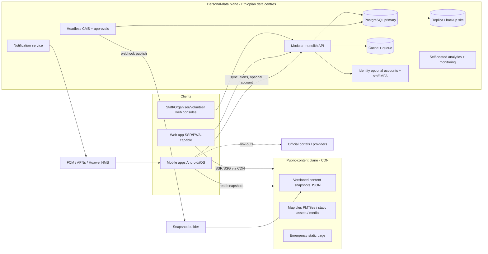

# Phase 11 — Technical Architecture (draft v1, 2026-10-01)
Scope: architecture options, evaluation and a recommended reference architecture. **No code, no stack lock-in yet:** where evidence cannot separate options, a short, defined test ("spike") decides. Inputs: requirements and decisions D1–D16, personas, IA, flows, Ethiopian digital landscape, benchmarks.
Method note: choices are judged on product requirements and constraints (below), not on convenience.

## 1. Requirements that drive the architecture
### 1.1 Functional shape (from Must/Should features)
Bilingual (EN/AM) content-led app: programme, maps, city guides, news, alerts, explainers, link-outs; personal agenda (device-first); optional accounts; organiser/volunteer/staff roles; CMS with approvals and emergency publishing; multi-event data model (D5); archive.
### 1.2 Non-functional requirements (NFRs)
| ID | NFR | Target (proposed, to be validated) |
|---|---|---|
| N1 | Platforms | Android, iOS, web (D9) |
| N2 | Languages | English + Amharic from day one; correct Ge'ez rendering on real devices (D11); extensible to more |
| N3 | Offline | Core content usable offline (offline tiers in IA §9); sync when online |
| N4 | Performance | Fast on low-end Android and mid-range networks; small downloads; first useful content < ~3 s on typical 4G (to measure) |
| N5 | Traffic profile | Highly read-heavy; sharp peaks (opening, announcements, alerts); global remote audience + Addis on-site crowd (congested cells) |
| N6 | Availability | Public content stays available even if origin servers fail; event-period target 99.9%+ for content, graceful degradation |
| N7 | Data residency | Personal data collected locally stored on servers in Ethiopia (PDPP Art. 22; see §4) |
| N8 | Privacy | Minimal data; guest mode; consent; deletion/export; no mandatory tracking (Hayya lesson) |
| N9 | Security | Role-based access, MFA for staff, audit log, DDoS resilience, secure supply chain |
| N10 | Accessibility | WCAG 2.1 AA target; screen readers incl. Amharic content |
| N11 | Ownership/portability | Government may own and operate it: open standards, open-source components where possible, no unexportable vendor lock-in, documented, reproducible deployment |
| N12 | Event-agnostic | Event as root entity; configuration, not code, to run a new event (D5) |
| N13 | Operability | Observability, backups, runbooks, emergency publishing, status page |
| N14 | Cost | Low recurring cost; free/open components preferred (no budget, D-resources) |

### 1.3 Planning assumptions (hypotheses; to be replaced by official numbers)
Event participants 50k–80k+ (cop32-context.md §3); remote followers worldwide; app/web monthly actives for COP32 in the order of 10⁵–10⁶ over the peak weeks (**assumption, no source**); concurrent peaks during alerts/opening. Load targets to be set from these ranges and verified by load tests (§9).

## 2. Architecture principles
1. **Content is the product; serve it as cacheable, versioned snapshots.** Most traffic reads the same data (schedule, guides, news). Publishing produces immutable JSON bundles served via CDN and cached on devices; the origin sees little read load.
2. **Two data planes.** (a) *Public-content plane* — no personal data, can be replicated and cached globally; (b) *Personal-data plane* — accounts, push tokens, consents, organiser/volunteer data — hosted in Ethiopia.
3. **Device-first personalisation.** Saved sessions, preferences and offline packs live on the device; sync/accounts are optional (minimises personal data).
4. **Modular monolith, not microservices.** One deployable backend with clear modules (Content, Programme, Notifications, Identity, Link-outs, Admin, Analytics). Splits only on evidence.
5. **Contract-first APIs** (OpenAPI) shared by mobile, web and admin; versioned.
6. **Graceful degradation tiers:** live API → cached snapshot → on-device pack → static emergency page.
7. **Open standards and open source** wherever practical (N11).
8. **Event-agnostic from day one:** every domain object carries `event_id`; configuration drives branding, languages, modules.
9. **Privacy by architecture:** no third-party SDKs that move personal/device data abroad without explicit review.

## 3. Architecture options considered
### 3.1 Client options
| Option | Description | Verdict |
|---|---|---|
| **A** | Flutter (Android/iOS) + separate SSR web app (e.g., Next.js) | Viable |
| **B** | React Native (Android/iOS) + separate SSR web app (e.g., Next.js), TypeScript across mobile, web and backend | Viable |
| **C** | Flutter for Android/iOS **and** web (one codebase) | Viable but weak for public web (SEO, initial payload, accessibility of canvas-rendered UI) |
| **D** | Kotlin Multiplatform shared logic with native UIs (Compose/SwiftUI) + web | Viable; most native, duplicated UI |
| E | PWA only | Rejected by D9 (native apps required) |
| F | Fully separate native codebases per platform | Rejected: duplicated logic, slow evolution |

Evidence used (secondary 2026 comparisons, to verify by spike): Flutter shows consistent performance on low-end Android; React Native apps are typically a few MB smaller (Flutter ~4–8 MB larger due to the engine); KMP is closest to native with strong offline logic; all support SQLite-style local storage. Flutter draws its own text, so a bundled Ethiopic font renders identically on every device; React Native uses native text views, so Ge'ez rendering depends on bundled fonts and OEM behaviour.

### 3.2 Scored comparison (transparent; 1–3, 3 = best; weights in brackets)
| Criterion | A Flutter+Next | B RN+Next | C Flutter all | D KMP+native+Next |
|---|---|---|---|---|
| Amharic rendering consistency across devices [3] | 3 | 2 | 3 | 2 |
| Low-end Android performance [2] | 3 | 2 | 3 | 3 |
| Offline-first capability [2] | 3 | 3 | 3 | 3 |
| Public web quality: SEO, load, accessibility [3] | 3 | 3 | 1 | 3 |
| Native accessibility fidelity (screen readers) [2] | 2 | 3 | 2 | 3 |
| Cross-platform code reuse [2] | 2 | 3 | 3 | 2 |
| App size / data cost [1] | 2 | 3 | 2 | 3 |
| Long-term maintainability & portability (ecosystem, open source) [2] | 2 | 3 | 2 | 2 |
| UI prototype speed for the demo [1] | 3 | 2 | 3 | 1 |
| **Weighted total (max 54)** | **47** | **48** | **43** | **45** |
Reading: C is clearly weaker because of the public web. **A and B are effectively tied** (47 vs 48; scores are judgement, not measurement). The deciding factors — Ge'ez rendering consistency, performance on the real device mix in Addis, and screen-reader behaviour with Amharic — are empirical.
**Proposal:** do not decide by opinion; run a **comparative spike** (§10) building the same three screens (Amharic schedule list with search, offline mode, a map screen) in A and B and testing on the real Android device matrix + an iPhone. Choose the winner against pre-set criteria.

### 3.3 Backend and CMS options
| Layer | Options | Assessment |
|---|---|---|
| Backend style | Modular monolith (recommended) · microservices · serverless/BaaS (Firebase/Supabase cloud) | BaaS clouds conflict with data residency (N7) and portability (N11); microservices add complexity without need |
| Language/framework | TypeScript (Node) · Python (Django/FastAPI) · Go · Java/Kotlin | Any can meet NFRs. Favour a mainstream, well-documented ecosystem with strong OpenAPI tooling; TypeScript allows shared types with web (and RN). Decide with the CMS choice (they interact) |
| Database | **PostgreSQL** (recommended): relational model, JSONB for flexible content, full-text + trigram search, PostGIS for geo, mature backups/replication | MySQL possible; document DBs unnecessary |
| CMS | Self-hosted open-source headless CMS shortlist: **Payload, Strapi, Directus**; or custom admin | Needs: per-locale content and translation status, draft/publish, scheduled publishing, roles/permissions, revisions/audit, media library, webhooks (to build snapshots), Postgres. Notes to verify: Strapi's review-workflow and audit-log features may be paid tiers; Directus licence terms (source-available) must be checked for government ownership; Payload is MIT but code-first. Decide by a short spike against the list above |
| Search | Start with **PostgreSQL full-text + trigram** with our own Ge'ez normalisation (homophone folding, transliteration table); evaluate Meilisearch/Typesense/OpenSearch by test | No source found for Ethiopic tokenisation in these engines → must test, not assume |
| Cache/queue | Redis-compatible cache; simple job queue (Postgres-based or Redis) | Avoid heavy brokers |
| Auth | Standards-based (OIDC/OAuth2); optional accounts via email one-time code (phone/SMS optional later); staff with MFA; RBAC. Self-hosted IdP (e.g., Keycloak/Ory) vs framework-native — decide in Phase 13 | |
| Analytics | Self-hosted, privacy-respecting web/app analytics (e.g., Matomo/Plausible/PostHog self-hosted) with aggregate-only reporting | Avoid SDKs sending device IDs abroad (confirm with legal in Phase 13) |
| Error monitoring | Self-hosted (e.g., Sentry-compatible/GlitchTip) | |

## 4. Data residency and hosting (hard constraint)
**What the law says (Proclamation 1321/2024, text consulted via a secondary reprint — verify against the Negarit Gazette):**
- **Art. 22(1)** data controllers/processors must ensure storage of personal data **collected or obtained locally** on servers in Ethiopia; **22(2)** the Authority may designate *critical personal data* for Ethiopia-only processing; **22(3)** cross-border transfer of **sensitive** personal data needs the Authority's prior approval.
- **Art. 20** cross-border transfer allowed under conditions (adequate protection, explicit consent, necessity, public registers).
- **Art. 33** registration of controllers/processors; **Art. 40** a Data Protection Officer is required where **government bodies** process data (relevant once the government owns the platform) or for large-scale monitoring/sensitive data.
- **Art. 43–44** breach notification to the Authority and to data subjects within **72 hours**.
- **Art. 28/32** rights to erasure and data portability; **Art. 8** consent must be free, informed, specific and an active action; **Art. 11(4)** marketing/profiling of minors not allowed.
- **Art. 60** fines up to 4% of worldwide turnover; **Art. 64** criminal penalties incl. 1–10 years for certain offences.
**Architecture response**
1. **Personal-data plane hosted in Ethiopia** in a local data centre. Candidates reported: Ethio Telecom data centre/"telecloud" (Tier-III Gola Sefer facility), Raxio Ethiopia (carrier-neutral Tier-III), Safaricom Ethiopia, Wingu.Africa, WebSprix sovereign cloud (sources: DCD, operator sites; **verify certification, SLA, price, interconnect and API/Kubernetes support**). Preferred: two facilities (primary + backup) with diverse operators.
2. **Public-content plane** (no personal data) served from a CDN. Cloudflare reports an Addis Ababa point of presence (ADD); other CDNs may exist. Public snapshots are not personal data, so global CDN use is compatible — confirm with legal.
3. **Guest mode and device-first storage** shrink what must be stored centrally.
4. **Push messaging:** tokens stored in Ethiopia; payloads contain no personal data; FCM/APNs inherently transit Google/Apple — disclose in the privacy notice.
5. **No third-party SDKs** that transmit personal/device data abroad without a documented lawful basis (analytics, crash, ads, social login).
6. Government ownership will make the platform subject to Art. 40 DPO duty and public-sector exceptions (Art. 53) — design admin and audit features accordingly.
**Legal verification needed (Phase 13):** meaning of "collected locally" for tourists/foreign visitors; whether anonymous usage telemetry counts as personal data; whether CDN logs count; transfer rules for push tokens.

## 5. Recommended reference architecture

**Key flows**
- *Publish:* editor drafts (EN/AM) → approval → publish → webhook → snapshot builder writes new immutable versioned bundle (+ manifest with version/ETag) → CDN invalidation → clients fetch the manifest and only changed bundles.
- *Alert:* staff publishes alert (emergency path) → notification service sends push to segments + writes alert feed bundle → clients poll the small alert feed when push is unavailable.
- *Personal agenda:* stored on device; optional sync (account) via API (last-write-wins or simple merge).
- *Link-out registry:* part of the snapshot; interstitial rendered client-side.

## 6. Offline and sync design
- **Content bundles:** Tier A (FAQ, arrival checklist, emergency, schedule snapshot, venue/city maps) downloaded by default; Tier B on demand; media online only.
- **Local database** on device (SQLite-class) for programme, POIs, guides; full-text search on device over downloaded content.
- **Delta sync:** manifest with bundle versions + checksums; resumable downloads; Wi-Fi-preferred background fetch; storage quota controls (Settings).
- **Conflict policy:** user data (agenda, favourites) is device-owned; synced copy is merged by item (timestamped).
- **Offline maps:** vector tiles (OSM-based, PMTiles/MBTiles) for Addis + venue region; styles and fonts (including Ge'ez glyph sets) bundled.
- **Time:** all timestamps UTC; display event time + user time.

## 7. Component recommendations (pending spikes/legal)
| Component | Recommendation | Why | Alternatives / open items |
|---|---|---|---|
| Web | SSR/SSG framework (e.g., Next.js or equivalent) with CDN caching | SEO, accessibility, fast first load, shareable URLs, press access | Other SSR frameworks fine; decision tied to CMS/language |
| Mobile | Flutter **or** React Native → decided by spike (§10) | Near-tie on scoring | Native/KMP kept as fallback |
| Maps | MapLibre + self-hosted OpenStreetMap vector tiles; curated POI layer; hand-off to device map apps for navigation | Offline, no per-load fees, no data to third parties; Google Maps data reported as outdated in Addis; OSM transit data for Addis is community-maintained | OSM completeness for Addis addresses is limited (~3,000 streets mapped, 552 named per OSM wiki) → rely on curated POIs; contribute improvements; evaluate commercial tiles (cost/privacy) |
| Public transport | Ingest open GTFS (AddisMap/DigitalTransport4Africa 2026) | Exists and open | No official real-time feed; scheduled/estimated times only |
| Push | Own notification service using FCM + APNs directly; evaluate Huawei HMS push | Control of data, no third-party SaaS in the loop | Third-party SaaS (e.g., OneSignal) supports Huawei but moves device tokens abroad → legal check. Huawei share in Ethiopia unknown (research gap) |
| Streaming/video | Link or click-to-load embed of official streams; no self-hosted video in MVP | Rights unknown; cost; privacy (embeds can leak data) | If hosting needed later: HLS via CDN |
| Search | Postgres FTS + trigram + Ge'ez normaliser (+ on-device search) | Minimal infrastructure; full control of Amharic behaviour | Meilisearch/Typesense/OpenSearch after test |
| Email | Transactional email via provider with Ethiopian-resident option or self-hosted relay | OTP, digests | Provider choice with legal review |
| SMS (later) | Only if needed (OTP/alerts) via local operator | Cost, privacy | D9 parked |
| Infra | Containers on VMs/Kubernetes in Ethiopian DC; IaC; CI/CD; staging environment | Reproducible, portable handover | Managed services mostly unavailable locally → self-operated components |

## 8. Security, privacy and governance in the architecture
- **Threat model themes:** account takeover (staff), content tampering (fake alerts/news), DDoS at peak, scraping, XSS/injection, abuse of organiser portal, supply-chain compromise, link-out spoofing, impersonation of the "official" app (D1).
- **Controls:** OWASP ASVS-based requirements; RBAC with least privilege; MFA for all staff; signed content manifests (clients verify bundle signatures so a hijacked CDN cannot inject content); dual-approval for emergency alerts (with audit); rate limiting; WAF/DDoS protection at CDN; secrets management; dependency and container scanning; SBOM; backups encrypted; audit log immutable; penetration test before pilot and before event (roadmap gates).
- **Privacy by design:** guest-first; minimal permissions; on-device agenda; no advertising IDs; consent management; erasure/export endpoints (PDPP Art. 28/32); DPO-ready logging and breach runbook (72 h).
- **Moderation:** user-generated content is minimal in MVP; organiser content goes through approval.

## 9. Scalability and reliability plan
- **Read path:** snapshots on CDN + on-device cache → origin load is small and predictable. Cache-control: immutable versioned URLs + short-TTL manifest.
- **Write/dynamic path:** accounts, sync, alerts feed, organiser portal — low volume; horizontal scale of stateless API behind a load balancer; DB with replica; connection pooling.
- **Push at scale:** batched sends with provider rate limits; segment by language/topic; exponential retry; fallback to polling the alert feed.
- **Degradation:** if origin fails → CDN snapshots continue; if CDN path fails → on-device bundles; if both → emergency static page and offline pack.
- **Disaster recovery (proposed targets):** RPO ≤ 15 min, RTO ≤ 1 h in the event window; second Ethiopian site for backups/warm standby; tested restore drills; runbooks for alert publishing without the CMS (break-glass).
- **Load testing:** simulate peaks (opening, mass alert) from realistic distributions; test manifest polling storms; verify low-end Android + throttled network performance. Targets set after official attendance data.
- **Capacity sizing:** first from the planning range, then re-run after the pilot using real usage.

## 10. Spikes (short, scoped proofs) — proposed
| # | Spike | Question | Decision rule |
|---|---|---|---|
| S1 | Mobile framework: Flutter vs React Native | Which renders Amharic best, performs on low-end Android, supports offline DB/search, passes screen-reader tests, builds small? | Build identical 3 screens; test on ≥5 Android models (incl. low-end and different OEM font stacks) + 1–2 iPhones; pick higher score on pre-agreed checklist (rendering defects = disqualifying) |
| S2 | CMS: Payload vs Strapi vs Directus | Per-locale workflow, scheduled publish, roles, revisions/audit, webhooks, licence suitability for government ownership | Checklist + licence review |
| S3 | Search: Postgres FTS vs Meilisearch/Typesense | Ge'ez homophone folding, transliteration, relevance on a sample programme | Test queries (EN/AM/mixed) |
| S4 | Maps: MapLibre + PMTiles offline | Addis tiles size, rendering speed on low-end, Ge'ez labels in map style | Size/performance thresholds |
| S5 | Hosting: Ethiopian DC feasibility | Price, SLA, network capacity, ability to run containers/Kubernetes, peering to CDN, DR site | Written quotes + test deployment |
| S6 | Push: FCM/APNs/HMS delivery | Delivery on typical Ethiopian devices, Huawei devices, latency on local networks | Measured on test devices |
| S7 | Snapshot sync: manifest + delta bundles | Size, update speed on weak networks, signature verification | Prototype |
These are engineering experiments; their outcomes become decisions in the decision log.

## 11. Environments, delivery and quality
- Environments: dev, staging (mirrors production), production (+ DR). Infrastructure as code. CI/CD with automated tests, linters, dependency scanning, signed builds.
- Testing: unit/integration/E2E; **device matrix** for Amharic rendering and performance; accessibility audits (TalkBack/VoiceOver, WCAG checks); load tests; security tests; content freeze and rollback procedures.
- Observability: logs, metrics, traces (self-hosted), uptime checks from outside Ethiopia and inside, public status page, on-call runbooks for event days.
- Release channels: store tracks (internal/closed testing), staged rollouts, feature flags, remote config (self-hosted) for emergency switches.

## 12. Integrations hooks (details in Phase 12)
Schedule import (CSV/JSON/ICS; adapter for host feeds if they exist) · link-out registry · GTFS ingestion · stream links · email/push providers · analytics export (aggregate) · optional open read API for partners later (ADM-10).

## 13. Risks (architecture-specific)
| # | Risk | Mitigation |
|---|---|---|
| A1 | Ethiopian hosting capacity/quality unknown | S5 spike; two DCs; CDN offload; static fallback |
| A2 | Data-localisation interpretation | Legal opinion; personal-data minimisation; separate planes |
| A3 | Ge'ez rendering/search defects | D11, S1, S3, device matrix |
| A4 | Push delivery gaps (Huawei, OEM battery limits) | S6; polling fallback; in-app alerts |
| A5 | Venue/organiser data unavailable | Manual import; link-outs; TBC states |
| A6 | Peak traffic exceeds estimates | CDN-first reads; load tests; degradation tiers |
| A7 | CMS licence/features block government ownership | S2 licence review; avoid enterprise-only dependencies |
| A8 | Third-party SDK data leakage | SDK review gate; self-hosted analytics |
| A9 | Content tampering or fake alerts | Signed manifests, dual approval, audit |
| A10 | Maps data gaps in Addis | Curated POIs; community mapping; verify with field checks |

## 14. Open questions / research gaps
1. Official attendance and expected app usage; host's own platforms (to avoid duplicate infrastructure and to integrate).
2. Does the host/government mandate a specific hosting provider or government cloud?
3. PDPP interpretation for visitors, telemetry, CDN logs and push tokens; role of the supervisory Authority (set-up status).
4. Huawei/other OEM share and push behaviour in Ethiopia.
5. Ethiopian Sign Language/captioning tooling (accessibility, Phase 14).
6. Ethio Telecom or other operators: zero-rating/discount for the app (partnership lever) and network behaviour at the venue.
7. Primary-source verification of framework comparison claims (secondary blogs used).

## 15. Proposed decisions (see decision log)
- **D17:** adopt the reference architecture (two data planes, snapshot-based content delivery, modular monolith, PostgreSQL, self-hosted open-source CMS, personal-data plane in Ethiopia, CDN for public content, OSM/MapLibre maps, own notification service, self-hosted analytics).
- **D18:** choose the mobile framework (Flutter vs React Native) by spike S1; web uses an SSR framework; CMS and search decided by S2/S3.

## 16. What comes next
Phase 12 (data & integration strategy) will detail each integration's owner, API availability, format, auth, update frequency, risk and fallback; Phase 13 will resolve the legal questions above.
