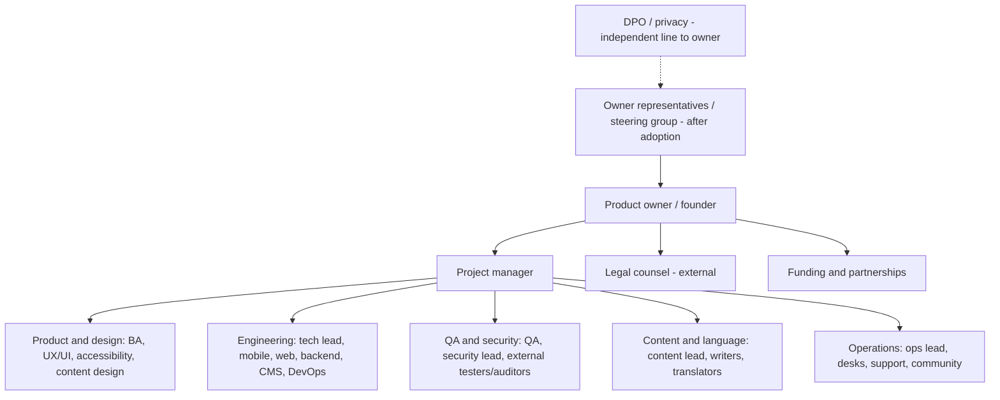

# Phase 19 — Project Team: Required Functions (draft v1, 2026-10-03)
**Scope and method.** This document lists the **functions (roles) the project requires**, derived from the roadmap (R1–R15), workstreams (A–H) and the approved requirements. It does not assess or assume who currently covers which function; the *Coverage register* (§9) is a blank template for the founder to complete privately. Essential MVP functions are distinguished from later ones as the brief requires. Headcounts are not specified: one person may cover several functions where the work and independence rules allow, and some functions are naturally external.

## 1. Principles
1. **Functions, not headcount.** Roles are defined by responsibility and skill; coverage is a separate decision.
2. **Independence where it matters.** The DPO/auditor, independent security testers and accessibility auditors must not review their own work; alert publisher and authoriser are different people (D31).
3. **Critical functions have a named deputy** (alert authorisation, incident lead, technical on-call, DPO) to avoid single points of failure.
4. **Native-language competence is a requirement,** not a nice-to-have: Amharic reading/writing, Ge'ez typography and terminology cannot be outsourced to machine tools.
5. **Security, privacy and accessibility are team-wide skills** (training), with specialist oversight.
6. **Everyone with access to code, content systems or personal data signs IP, confidentiality and security terms before starting** (D39).
7. **Event-time roles are positions on a roster,** staffed by whoever is trained and certified for them.

## 2. Function catalogue
Legend — **Tier:** E = essential for Demo/Pilot; P = needed by Pilot/Event release; V = event-time (Oct–Nov 2027); L = later (post-event / long-term). **Mode:** C = core team; X = external/contract/vendor; A = advisor; H = host/owner-provided; I = independent (must not be internal to the work it reviews).

### 2.1 Leadership, product and governance
| Function | Responsibilities | Key skills | Needed (roadmap) | Tier | Mode |
|---|---|---|---|---|---|
| **Product owner / founder** | Vision, priorities, backlog decisions, gate decisions, stakeholder relationships, final say on scope | Product strategy, public sector sensitivity, decision-making | R1–R15 | E | C |
| **Project manager** | Plan, risks, dependencies, gate reviews, reporting, meetings, vendor coordination, change control | Delivery management, risk management, documentation | R3–R15 | E | C |
| **Business analyst** | Requirements, backlog refinement, acceptance criteria, user research (interviews, card sorts), traceability, data/CSV templates | Elicitation, writing, testing mindset, Amharic/English | R2–R12 | E | C |
| **Programme/stakeholder liaison (host & government)** | Relationship with Secretariat, Task Force, ministries, UNFCCC contacts; data requests; alert-authorisation protocol; formal correspondence | Protocol, diplomacy, Amharic/English, government procedures | R1–R14 | E | C or A |
| **Funding & partnerships lead** | Grants, in-kind agreements, sponsor screening, startup certification, donor reporting | Grant writing, budgeting, partnerships | R2–R15 | E | C or A |
| **Finance/accounting** | Bookkeeping, budgets, tax/VAT, net-income statements (PPR), contracts payments | Ethiopian accounting/tax | R1–R15 | E | X or C |
| **Legal counsel** | Company set-up, IP assignments, PPR agreement, data-protection roles, contracts, media-law opinion, terms/privacy, procurement | Ethiopian commercial, IP, data and media law | R1–R15 (peaks at G1, G2, pilot) | E | X |
| **Data protection officer (DPO) / privacy lead** | DPIA, records of processing, subject requests, breach readiness, regulator liaison, privacy notices | Ethiopian PDPP, GDPR basics, audit | R6–R15 | P (advisor from R6; formal DPO when government owns) | A/I → H |
| **Steering group (owner representatives)** | Strategic oversight after adoption; approvals at gates | Government and domain knowledge | R7–R15 | P | H |

### 2.2 Product design and research
| Function | Responsibilities | Key skills | Needed | Tier | Mode |
|---|---|---|---|---|---|
| **UX researcher** | Interview planning/analysis, tree tests, usability tests (including with disability organisations) | Research methods, facilitation, Amharic/English | R2–R11 | E (can be shared with BA) | C/X |
| **UX designer** | Flows, wireframes, interaction patterns, bilingual layouts, prototypes | Mobile/web UX, accessibility, Ge'ez-aware layout | R4–R12 | E | C/X |
| **UI designer / design-system lead** | Visual design, tokens, components, light/dark, icon set, motion, store assets | Visual design, Figma-type tools, typography incl. Ethiopic | R5–R12 | E | C/X |
| **Accessibility specialist** | Standards (WCAG 2.2 AA), patterns, reviews, test plans, assistive-tech testing | Screen readers (TalkBack/VoiceOver/NVDA), Amharic content issues | R4–R12 | E | C/X |
| **Content designer / information designer** | Microcopy, plain language, IA labels, content models | Writing, UX writing in EN/AM | R4–R12 | E | C/X |
| **Illustrator / photographer / audio-video producer** | Imagery, explainers, narration recording, short videos | Production, licensing | R7–R13 | P | X |

### 2.3 Engineering
| Function | Responsibilities | Key skills | Needed | Tier | Mode |
|---|---|---|---|---|---|
| **Technical lead / architect** | Architecture decisions, spikes, standards, code quality, security by design, technical risk | Systems design, cloud, mobile/web, data | R6–R15 | E | C |
| **Mobile developer — Android** | Native/cross-platform app, offline, performance on low-end devices | Chosen framework (S1), Android internals, accessibility | R7–R14 | E | C |
| **Mobile developer — iOS** | iOS app with parity quality | Chosen framework, iOS internals, accessibility | R7–R14 | E | C |
| **Web developer** | SSR web app, PWA behaviours, SEO, accessibility | Web standards, performance, i18n | R7–R14 | E | C |
| **Backend developer** | API, snapshot builder, notification service, auth, imports, admin APIs | Chosen backend stack, PostgreSQL, security | R7–R14 | E | C |
| **CMS/editorial-tool developer** | CMS configuration, workflows, editorial layer, admin consoles | CMS platform (S2), React/TypeScript or similar | R7–R13 | E | C |
| **DevOps / cloud (Ethiopian hosting) engineer** | Infrastructure as code, CI/CD, monitoring, backups, DR, DDoS posture, key management | Linux, containers, networking, observability | R6–R14 | E | C/X |
| **Search/localisation engineer** | Ge'ez-aware search, normalisation, i18n/ICU, fonts, calendar/time rules | NLP basics, i18n, Ethiopic script | R6–R12 | P (can be part of backend/mobile) | C/X |
| **Data/analytics engineer** | Privacy-preserving aggregate analytics, dashboards | Data modelling, privacy | R8–R14 | P (basic) / L (advanced) | C/X |
| **Maps/GIS specialist** | Tiles, POI curation, offline maps, venue mapping | OSM, MapLibre, GIS | R7–R13 | P | X/C |

### 2.3b Quality, security and privacy
| Function | Responsibilities | Key skills | Needed | Tier | Mode |
|---|---|---|---|---|---|
| **QA engineers (manual + automation)** | Test plans, device-matrix runs, regression, release criteria | Mobile/web testing, automation | R7–R14 | E | C |
| **Security lead / architect** | Threat models, secure SDLC, vulnerability management, incident response | AppSec, cloud security, OWASP ASVS/MASVS | R6–R14 | E | C/X |
| **Independent penetration testers** | Pentest 1 and 2 (web, API, mobile, admin) | Offensive security | R10 | E (external) | X/I |
| **Independent accessibility auditor** | Conformance audit, VPAT-style report | WCAG 2.2, assistive tech | R9 | E (external) | X/I |
| **Disability-organisation testers/partners** | Usability testing with real users (deaf, blind/low-vision, mobility) | Lived experience; facilitation support | R9, R11 | E | A/X |
| **Linguist / Amharic technical reviewer** | Search normalisation rules, typography review, terminology | Amharic linguistics | R6–R12 | E | A/X |

### 2.4 Content and language
| Function | Responsibilities | Key skills | Needed | Tier | Mode |
|---|---|---|---|---|---|
| **Content lead / editor-in-chief** | Editorial policy, standards, quality gate, corrections, source labelling, tracks | Editing, fact-checking, neutrality | R4–R14 | E | C |
| **Writers/editors (EN & AM)** | Guides, explainers, FAQs, news summaries | Plain-language writing, research | R7–R14 | E | C/X |
| **Translators (EN↔AM) and native reviewers** | Translation, review, glossary | Professional translation, climate terminology | R7–R14 | E | X/C |
| **Terminology/glossary owner** | Approved Amharic terms, style guide | Terminology management | R7–R14 | E | C/A |
| **Cultural reviewer** | Imagery, customs, holidays, etiquette (e.g., Buna, churches) | Cultural expertise | R7–R13 | P | A |
| **Programme data manager** | Imports, diffs, validation, speaker/organisation data | Data quality, spreadsheets | R8–R13 | P | C/H |
| **Voice/narration talent** | Amharic/English audio | Recording | R8–R13 | P | X |

### 2.5 Operations, community and support
| Function | Responsibilities | Key skills | Needed | Tier | Mode |
|---|---|---|---|---|---|
| **Operations lead / incident lead** | Event operating model, runbooks, rosters, drills, incident command | Operations, crisis communication | R10–R14 | V (planning from R10) | C/H |
| **Duty editors (content desk)** | Fast-track publishing, digests, corrections | Editing under pressure | R13 | V | C/X |
| **Schedule desk** | Programme changes, notifications | Data accuracy | R13 | V | C/H |
| **Alert desk (publisher + authoriser positions)** | Alerts from authorised sources with dual approval | Calm, precise, trained/certified | R13 | V | C/H |
| **Translation desk** | EN/AM parity on Fast track | Translation speed | R13 | V | X/C |
| **Moderators** | Organiser submissions, reports, takedowns | Policy application | R13 | V (pilot basic) | C/X |
| **Technical support / user support** | User requests, issue triage, deletion/export requests | Support, privacy | R11–R14 | P→V | C/X |
| **Community/outreach manager** | Communications, social channels, press relations, partner coordination | Communications in EN/AM | R7–R15 | P | C/X |
| **Volunteer coordinator** | Volunteer handbook/FAQ and operational broadcasts (if the platform supports volunteers) | Coordination | R12–R13 | V | H/C |
| **Trainers** | Staff and authoriser training, drills | Training design | R10–R13 | P/V | C/X |
| **Host liaison on duty** | Link between host operations and the platform's ops cell | Authority to relay | R13 | V | H |

## 3. Essential MVP functions vs later (summary)
- **Essential for Demo and Pilot (E):** product owner; project manager; business analyst; host/government liaison; funding/partnerships lead; finance; legal counsel; UX/UI design; accessibility specialist; content design; technical lead; Android, iOS, web and backend development; CMS/editorial tool development; DevOps/cloud; QA; security lead; independent pentesters and accessibility auditor (external); disability-organisation partners; Amharic linguist/reviewer; content lead, writers, translators and glossary owner.
- **Needed by Pilot/Event release (P):** DPO/privacy lead (advisor first); search/localisation engineering; analytics engineering (basic); maps/GIS; cultural reviewer; programme data manager; narration; community/outreach; support; trainers.
- **Event-time (V):** operations/incident lead; duty editors; schedule, alert and translation desks; moderators; volunteer coordination; host liaison on duty.
- **Later (L):** advanced analytics, event-setup wizard development, additional-language translators (Wave 2), white-label implementation roles, ongoing retainer support.

## 4. Function × roadmap phase matrix
Legend: ● primary effort · ○ supporting · blank none.
| Function \ Phase | R4 UX | R5 UI | R6 Arch | R7 Demo | R8 MVP | R9 Test | R10 Sec | R11 Pilot | R12 Launch | R13 Event | R14 Post | R15 Long |
|---|---|---|---|---|---|---|---|---|---|---|---|---|
| Product owner | ● | ○ | ○ | ● | ● | ○ | ○ | ● | ● | ● | ● | ● |
| Project manager | ○ | ○ | ○ | ● | ● | ● | ● | ● | ● | ● | ● | ○ |
| Business analyst | ● | ○ | ○ | ○ | ● | ● | ○ | ○ | ○ | ○ | ○ | |
| Liaison / partnerships | ○ | | | ● | ○ | | | ● | ● | ● | ● | ● |
| Legal / DPO | | | ● | ○ | ● | | ● | ● | ● | ● | ● | ○ |
| UX / UI / accessibility / content design | ● | ● | | ● | ● | ● | | ○ | ○ | | | ○ |
| Tech lead / architect | | | ● | ● | ● | ○ | ● | ○ | ● | ○ | ○ | ● |
| Mobile / web / backend / CMS engineers | | | ○ | ● | ● | ● | ● | ○ | ● | ○ | ○ | ● |
| DevOps | | | ● | ○ | ● | ○ | ● | ● | ● | ● | ● | ● |
| QA | | | | ○ | ● | ● | ○ | ● | ● | ○ | ○ | ○ |
| Security lead / testers | | | ● | | ○ | ○ | ● | ○ | ● | ● | ● | ○ |
| Content lead / writers / translators | ○ | | | ● | ● | ● | | ● | ● | ● | ● | ○ |
| Operations / incident lead | | | | | | | ○ | ○ | ● | ● | ● | ○ |
| Desks (alerts, schedule, translation, moderation) | | | | | | | | ○ | ○ | ● | ○ | |
| Support / community | | | | | | | | ● | ● | ● | ● | ○ |
| Trainers | | | | | | | ○ | ○ | ● | ● | | |

## 5. Event-time roster model (positions, not headcount)
Positions that must be staffed continuously during the event window (final figures depend on the official programme hours and zone coverage):
| Position | Always staffed? | Notes |
|---|---|---|
| Incident lead (+ deputy on call) | Yes (24/7) | Decision authority matrix; liaison with host ops |
| Alert publisher **and** alert authoriser | Yes (24/7), two different people | Hardware keys; drills certification |
| Duty editor (content + corrections) | Yes (extended hours; on call at night) | Fast track |
| Schedule desk | During programme hours | Programme changes |
| Translation desk (EN/AM) | During programme hours; on call at night | Alerts use templates for speed |
| Moderation/support desk | Extended hours | Organiser submissions, reports |
| Technical on-call (platform + infrastructure) | Yes (24/7) | Kill switches, mitigations |
| DPO/security on call | Yes (on call) | Breach clock (72 h) |
| Host liaison | Yes (host-provided) | |
**Roster arithmetic (when the event schedule is known):** persons needed = positions × hours per day × days ÷ allowable hours per person per shift, adjusted for rest rules, handover overlap and training; add deputies for critical positions. Computed in R10 once the official programme hours are known.

## 6. Organisation and governance

### 6.1 Decision rights
| Decision | Decides | Consulted | Informed |
|---|---|---|---|
| Scope, priorities, gate go/no-go | Product owner (with owner reps after adoption) | PM, BA, tech lead, content lead | All |
| Architecture and stack | Tech lead (with spikes) | Security lead, DevOps, engineers | Product owner |
| Release approval | Product owner on QA/security/accessibility sign-off | PM, QA, security lead | Owner |
| Content policy and publication | Content lead / approvers (per tracks) | Legal, cultural reviewers | PM |
| Alerts | Authorised sources + dual approval (alert desk) | Incident lead | Owner |
| Privacy-affecting changes | DPO/privacy lead (veto on risk) | Legal, security | Product owner |
| Contracts, IP, PPR | Founder with counsel | Finance | Team |
### 6.2 RACI (R = responsible, A = accountable, C = consulted, I = informed)
| Deliverable | PO | PM | BA | TL | Eng | UX/UI/A11y | QA | Content | Sec | DPO | Legal | Liaison |
|---|---|---|---|---|---|---|---|---|---|---|---|---|
| Roadmap and gates | A | R | C | C | I | I | I | I | I | I | C | C |
| Backlog and acceptance criteria | A | C | R | C | C | C | C | C | C | C | | |
| Flows and design system | A | C | C | C | C | R | C | C | | | | |
| Architecture and spikes | I | I | C | A/R | R | C | C | | C | C | | |
| Build and releases | I | C | | A | R | C | C | | C | | | |
| Testing and accessibility audit | I | C | C | C | C | R | A/R | | | | | |
| Pentests and remediation | I | C | | R | R | | | | A/R | C | | |
| Content and translation | C | C | C | | | C | C | A/R | | | C | |
| Alert protocol and drills | A | R | | C | C | | C | R | C | C | | R |
| Privacy docs, DPIA, requests | C | C | | C | C | | | C | C | A/R | R | |
| Contracts, IP, PPR | A/R | C | | | | | | | | | R | |
| Outreach and data requests | A | C | C | | | | | C | | C | C | R |
| Funding applications | A/R | C | | | | | | C | | | C | C |
| Event operations | A | R | | C | C | | | R | C | C | | R |
### 6.3 Working agreements
Weekly planning and demo; fortnightly retrospective; monthly steering/gate preparation; decisions recorded in `docs/decisions/log.md`; written handoffs; definition of done includes accessibility, security, privacy and bilingual checks; code review required; documentation updated with changes; communication in English with Amharic for content and partner contact; core overlap hours across time zones; secure channels for sensitive topics; no sensitive data in chat.
### 6.4 Tools (proposal; open-source or low-cost first)
Issue tracker and roadmap board; documentation repository (this repo); design tool and design-token repository; source control with protected branches; CI/CD; secrets vault; password manager with MFA; secure chat/video; translation management; test device lab and cloud testing where privacy allows; incident management and on-call tool (self-hosted or paid); shared drive with access control.

## 7. Engagement models, contracts and onboarding
### 7.1 Legal findings that shape engagement
- **Employment law (Labour Proclamation 1156/2019, per secondary summaries):** employment contracts may be written or unwritten, but an employer must give a signed written statement within 15 days if not written; a written contract must name the parties, worker details, agreement and signatures; probation may not exceed 60 consecutive days; persons who perform acts for consideration **at their own business or professional responsibility** (independent contractors) are outside the proclamation's scope. The proclamation's treatment of **unpaid volunteers** was not found — counsel to advise on how to classify volunteer contributors and avoid unintended employment.
- **Copyright law (Proclamation 410/2004, as amended):** for works created by an employee or a commissioned author in the course of employment or contract, the employer/commissioner is the original rights owner **unless agreed otherwise**; computer programs are protected as literary works. **Volunteers are neither employed nor commissioned, so default ownership would stay with each author** — which is why signed **written assignments are mandatory** (D35, D39). Patent law similarly vests invention rights in the commissioner/employer by default (secondary source).
### 7.2 Engagement types
| Type | Used for | Key terms |
|---|---|---|
| Volunteer contributor (pre-funding) | Current core contributors | IP assignment; confidentiality; contribution ledger (L6); PPR enrolment; code of conduct; exit terms; counsel's view on classification |
| Employee | Roles funded by contracts/grants | Written employment contract (compliant with the labour proclamation); IP/confidentiality clauses; probation within limits; security training |
| Independent contractor / consultant | Designers, translators, auditors, event-time specialists | Service agreement; deliverables; IP assignment; confidentiality; insurance where needed |
| Vendor | Pentest firms, hosting, narration, translation agencies | Contract, NDA, SLAs, data-processing agreement; independence statements |
| Partner organisations | Disability organisations, universities | MOU; compensation for participants; ethics |
| Host-provided personnel | Liaison, authorisers, DPO (government) | Protocol; confidentiality; clear authority |
### 7.3 Compensation mapping (from the compensation stack, business model §7.5)
Paid roles under grant or contract budgets (L1/L2) wherever funding allows; unpaid/deferred contributions recorded in the ledger (L6) and recognised through the PPR pool (L5); external specialists paid per deliverable; no function is staffed on promises that conflict with donor rules.
### 7.4 Onboarding checklist (every person)
1. Signed IP assignment, confidentiality, code of conduct, conflict-of-interest declaration. 2. Role description, access request, least-privilege access, MFA. 3. Security and privacy training (secure handling of personal data; phishing; secrets). 4. Project orientation: decisions log, roadmap, editorial standards, accessibility and Amharic basics. 5. Tool accounts. 6. For event roles: certification (alert drills, incident procedures). 7. PPR/ledger enrolment where applicable. 8. Offboarding: access revocation, handover notes, return of devices/keys.
### 7.5 Conflicts of interest and independence
Declare relationships with sponsors, vendors, host officials and competitors; no one reviews their own work in testing, audit, DPO oversight; sponsors cannot influence staffing or content; government secondees follow confidentiality and editorial independence rules.

## 8. Competency and training plan
| Topic | Audience | When |
|---|---|---|
| Amharic/Ge'ez typography, rendering and search | Designers, engineers, QA | Before R5–R8 |
| Accessibility (WCAG 2.2, TalkBack/VoiceOver, Amharic content) | Designers, engineers, QA, content | Before R5 |
| Secure coding (ASVS/MASVS), supply-chain hygiene | Engineers | Before R8 |
| Privacy and PDPP duties, data minimisation, subject requests | All staff, support | Before R11 |
| Plain-language and bilingual editorial standards | Content team | Before R7 |
| Alert protocol, drills, kill switches | Alert desk, incident lead, technical on-call, liaison | R10–R12, refresh before event |
| Incident command and communication | Ops cell | R10–R12 |
| Moderation policy and abuse handling | Moderators, support | R11–R12 |
| Host-protocol and cultural sensitivity for outreach | Liaison, outreach | R1–R7 |

## 9. Coverage register (template — to be completed privately by the founder)
Use initials or role codes only; do not store personal data in the repository.
| Function | Needed from (phase/date) | Covered by (initials / organisation) | Mode (C/X/A/H) | Status (covered / partly / open) | Notes (dependencies, contract status) |
|---|---|---|---|---|---|
| (copy rows from §2) | | | | | |

## 10. Role profiles (summary for recruiting or briefing)
Each profile: purpose · must-have skills · valuable extras · Ethiopia-specific requirements · independence/conflict notes.
- **Technical lead/architect:** owns architecture and spikes; must know cloud, mobile/web stacks, security-by-design; valuable: offline-first and i18n experience; Ethiopia-specific: awareness of data-localisation law and local hosting; independence: none.
- **Mobile engineers (Android, iOS):** performance on low-end devices, offline storage, accessibility APIs; valuable: Ge'ez rendering experience; Ethiopia-specific: test on locally common devices.
- **Web engineer:** SSR, performance budgets, accessibility; valuable: SEO and Ethiopic web fonts.
- **Backend/CMS engineer:** secure APIs, PostgreSQL, workflows, imports; valuable: Python/TypeScript depending on S2.
- **DevOps:** infrastructure as code, observability, DR; Ethiopia-specific: working with local data-centre operators.
- **QA/accessibility engineer:** device-matrix testing, assistive technology, Amharic test sets.
- **UX/UI designer:** bilingual design systems; Ethiopia-specific: Ge'ez typography, cultural fit.
- **Content lead:** editorial standards, neutrality, corrections; Ethiopia-specific: media-law awareness, Amharic editorial excellence.
- **Translator/reviewer:** professional EN↔AM translation; climate/policy terminology; confidentiality.
- **Security lead:** threat modelling, incident response; independence from external testers.
- **DPO/privacy lead:** PDPP and GDPR knowledge, audits; independent reporting line.
- **Operations/incident lead:** crisis communication and command; calm under pressure; coordination with host authorities.
- **Alert desk operators:** accuracy, templates, drill certification; hardware key custody.
- **Liaison/partnerships:** protocol, Amharic/English fluency, relationships with government and UN stakeholders.
- **Legal counsel:** Ethiopian company, IP, data protection, media and procurement law.

## 11. Risks
| # | Risk | Mitigation |
|---|---|---|
| T1 | Key-person dependency on critical functions | Deputies for alert authorisation, incident lead, technical on-call and DPO; documentation; pairing |
| T2 | IP ownership gaps (contributors not under contract) | Signed assignments before further work (D39) |
| T3 | Misclassification of volunteers vs employees | Counsel's advice; written agreements |
| T4 | Fatigue and errors during the event | Shift design, rest rules, handovers, templates, drills |
| T5 | Insufficient Amharic expertise or inconsistent terminology | Native reviewers, glossary, linguist, review gates |
| T6 | Conflicts of interest (sponsors, vendors, officials) | Declarations; independence rules; policy D36 |
| T7 | Onboarding delays for external testers/auditors | Early bookings (G2) |
| T8 | Host-provided roles not available (authorisers, liaison) | Early agreement; alerts relay disabled until staffed |
| T9 | Security/privacy training gaps | Mandatory onboarding training; refreshers |
| T10 | Unclear decision rights | Decision rights table; decisions log |

## 12. Open questions
1. Which functions will be covered by core contributors, contracted specialists, advisors or host personnel (to be answered in the coverage register)? 2. What classification and terms apply to volunteer contributors under Ethiopian law? 3. Who acts as DPO until the government owns the platform? 4. Which external vendors are available for pentest, accessibility audit and translation? 5. Which host personnel will staff authoriser and liaison positions? 6. Training delivery and certification provider. 7. Insurance requirements.

## 13. Proposed decisions
- **D40:** adopt the function catalogue (§2) and essential-vs-later tiers (§3) as the baseline definition of the required team for the roadmap; coverage is recorded privately in the register (§9).
- **D41:** adopt engagement types, onboarding checklist and independence rules (§7); written IP assignment, confidentiality and conflict declarations before work or access.
- **D42:** adopt the governance model, decision rights/RACI (§6) and the event-time roster positions (§5), with roster arithmetic computed in R10.
