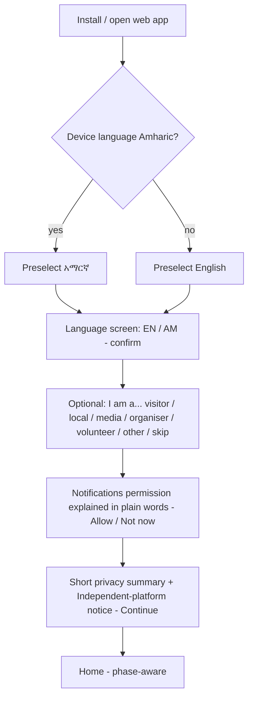
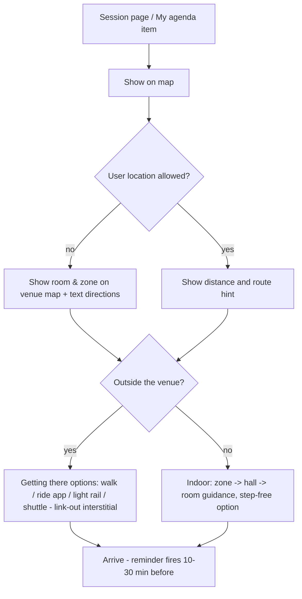

# Phase 10 — User Flows (draft v1, 2026-10-01)
Structure basis: IA D16 v2 (tabs **Home · Programme · Map · Visit · Updates** + header menu: Learn, Library, Archive, Me & Settings, Help, About; global language switch, search, bell, time-zone chip).
Feature IDs refer to docs/product/feature-catalog.md; priorities per docs/product/mvp-prioritization.md (D15).
These are **logical flows** (steps, decisions, system responses, edge cases), not screen designs.

## Conventions
- **Persona** P1–P15 (docs/ux/personas.md). **Rel** = earliest release: Demo / Pilot / Event / Post.
- Every flow must handle: **offline**, **TBC data** (unknown dates/venues/access), **EN/AM**, **time zone**, **accessibility** (screen reader, large text).
- System messages in *italics*.

## Cross-flow rules
1. No sign-in required for any public flow (PER-01). Sign-in only for sync, organiser tools, volunteer mode.
2. All external destinations go through the **link-out interstitial** (D14): *"You're leaving the app to [Provider]. We don't share your data."* → Continue / Cancel; opens in external browser/app.
3. Every date/time shows event time (EAT, UTC+3) and, if different, user time.
4. Content with a changeable status shows **source label + last updated**.
5. If data is unknown → show **"TBC"** with "Notify me when announced" (where notifications are allowed).

---
## F1 — First-time onboarding (P1, P2, all) · Rel: Demo
**Goal:** usable app in under 30 seconds, no account.

Steps & notes
1. Language choice (PER-03); time zone auto-detected and shown (PER-04).
2. Role choice is optional and changeable (PER-09); it only changes Home shortcuts.
3. Notification permission asked **with context**, never on launch without explanation (NOT-06, TRU-07). "Not now" is respected; ask again only when the user saves a session.
4. Privacy summary (TRU-01) + "Independent platform, not official" (TRU-04) with link to full notice.
5. Location permission is **not** requested here; only when the user taps "Near me" or directions (TRU-02).
6. Offline pack (NAV-13) downloads in background on Wi-Fi; user can manage in Settings.
Edge: no network on first open → bundled minimal content (overview, FAQ, emergency) and a "connect to update" banner.
Success: ≥ 90% complete onboarding; median < 30 s.

## F2 — Finding a session (P1, P4, P9…) · Rel: Demo (sample) / Event (real)
Entry: Programme tab · Home "Now & next" · search · share link/QR.
1. Programme → Schedule opens on **today** (or first day pre-event).
2. Quick filters: Day, **Open to public**, Theme; more filters sheet (venue, language, format, type, accessibility) (INF-03).
3. List items show: time (event + user tz), title, room/zone, access badge (Public / Accredited / Registration / TBC), format (in-person/hybrid/online), language.
4. Tap → Session page (INF-04): details, speakers, location → "Show on map" (NAV-02), stream link if any (MED-01), documents (INF-11), Save, Share.
Alternatives: search "finance" → Sessions scope; empty state → suggest clearing filters / related themes.
Edge: session cancelled → banner *Cancelled* + reason if known; access TBC → "Access not yet confirmed" + notify me.

## F3 — Saving a session (all) · Rel: Demo
1. On session list or page, tap **Save**.
2. If notifications not yet allowed: *"Get a reminder and change alerts for saved sessions?"* → Allow / No thanks.
3. *Saved to My agenda* + undo.
4. Conflict check: if overlapping with another saved session → *"Overlaps with [X]. Keep both?"* (PER-05).
Data stored on device; synced only if the user signs in (PER-12, later).

## F4 — Building a personal agenda (P1, P3, P5…) · Rel: Demo/Pilot
1. Programme → **My agenda**: saved items grouped by day, with travel time hints between venues (if known).
2. Actions: remove, reorder by time (automatic), set reminder lead time (PER-07: 10/30/60 min), **Export to calendar (.ics)**, share agenda.
3. Itinerary suggestions (PER-11): *"Free 2 hours on Tuesday afternoon — see a self-guided itinerary"*.
Edge: device time zone changes (travel) → times recalculated; banner shows the change.

## F5 — Finding a speaker (P3, P10) · Rel: Pilot
Programme → Speakers (A–Z, search, filter by organisation/theme) → Speaker page (bio EN/AM, organisation, sessions list) → Save speaker (PER-06) → alerts when their session changes. Search also finds speakers globally (INF-16), Ge'ez-aware.
Edge: no photo → initials avatar; bios missing in Amharic → show English with "translation pending".

## F6 — Finding an exhibitor or pavilion (P1, P11, P5) · Rel: Pilot/Event
Programme → Exhibitors & pavilions (filter: zone, theme, country/region) → page (description, projects, materials, contacts, location) → "Show on map" (EXH-05) / Save / Share. Contact options are links (email/website) — no in-app messaging (NET-04 is Later).

## F7 — Finding a venue or place (all) · Rel: Demo (city) / Event (venue)
1. Map tab opens on **venue view** during the event, **city view** otherwise.
2. Toggle Venue | City; category chips (Venues, Hotels, Hospitals, Pharmacies, Embassies, ATMs, Transport, Attractions, Coffee).
3. Tap POI → card (name EN/AM, hours, accessibility, source, last verified) → Directions (link-out, F8) / Call / Save.
Edge: venue plan not yet published → *"Venue map coming when announced (TBC)"* + city map still available.

## F8 — Navigating to a session (P1, P12) · Rel: Event

Notes: indoor turn-by-turn is Later (NAV-10); MVP uses zone/room maps + text. Accessible route toggle (NAV-09).

## F9 — Receiving schedule changes (all) · Rel: Pilot/Event
1. Staff updates a session in CMS (ADM-01/02) → change type (time, room, cancelled, speaker) → publish.
2. System sends **targeted** push to users who saved/follow the session (NOT-01, EXH-03), in their language.
3. Notification: *"Changed: [Session] now 14:00 EAT (your time 12:00) in Hall B."* → opens session with a **"What changed"** highlight.
4. Also listed in Updates → Alerts history and Home alerts.
Edge: user has notifications off → in-app banner on next open; offline → change shown after sync with "updated at" time.
Emergency variant (NOT-03): priority alert to all users/segment, bypasses quiet hours where OS allows; staff use emergency publishing (ADM-03) with audit log.

## F10 — Networking with another participant (P8, P11) · Rel: Should/Could (not MVP)
MVP-light: **Networking events listing** (NET-07) under Programme; **QR contact exchange** (NET-03, Should): Menu → Me → My contact card (opt-in fields only) → Show QR / Scan QR → *"Save contact?"* → saved locally. No directory of people, no messaging in MVP (privacy, moderation). Revisit post-validation (D13).

## F11 — Watching a live session (P4, P3) · Rel: Event
Entry: Updates → Live & recorded · Home "Live now" · session page.
1. List of live streams with language and captions availability.
2. Tap → embedded official player if permitted, else link-out to official stream (MED-01).
3. Below player: session info, speakers, documents, share.
Edge: stream not public → *"This session is not streamed publicly"*; low bandwidth → audio-only/low quality if the source supports it; geoblocking → explain.

## F12 — Accessing recorded content (P4, P10) · Rel: Event/Post
Updates → Live & recorded → filter (day, theme, language) → recording page (player or link, transcript/captions if available, related documents) → Save / Share. After the event the same content is in Menu → Archive (PST-01, PST-04).

## F13 — Participating in Q&A (P4, P1) · Rel: Could (not MVP)
Session page → "Ask a question" (if the organiser enabled Q&A) → type (EN/AM) → moderation queue → shown when approved; upvote others. Requires moderation staff (ADM-06) — therefore not MVP. MVP alternative: link to official Q&A channel if the organiser provides one.

## F14 — Accessing documents (P3, P10, P8) · Rel: Pilot
Menu → Library (or Session page → Documents, or search) → filter (type, theme, source) → document card (title, source label, date, version, size) → Open (link to official source via interstitial, or download if we host it) → Save for offline. Never re-host official documents without permission; link instead.

## F15 — Finding public information (P2, P4, P9) · Rel: Demo
Entry: Home highlights · Menu → Learn · search · Updates → Explainers.
1. Learn hub: COP explained · Climate basics · Africa & Ethiopia · Green Legacy · Glossary · Myth-busting.
2. Article: plain language, EN/AM switch, **Listen** (audio, MED-06 Should), source list at bottom, last reviewed date.
3. Related: sessions on this theme, outcomes tracker.
Edge: Amharic translation pending → English shown with visible note.

## F16 — Using the app after COP32 (all) · Rel: Post
1. Event state switches to **post** in CMS → Home shows Outcomes, Recordings, What happens next, Archive.
2. Menu → Archive → COP32 (and future events) → programme, recordings, documents, outcomes (PST-01..04).
3. Notifications reduced to opted-in follow-up topics; user can turn all off.
4. Platform can host the **next event** (ADM-08) — Archive keeps COP32 intact.

---
## Visit-planning flows (founder ideas F-01–F-09, D14)
### V1 — Visa (P1, P14) · Rel: Demo
Visit → Before you travel → Visa → guide: who needs a visa, e-visa steps, documents, timing, COP32-specific arrangements (**TBC** until announced) → **"Apply on the official e-visa portal"** → interstitial → official site. Checklist item "Visa" can be ticked (NAV-08).
Edge: guidance outdated → each guide shows last verified date + "report an issue".

### V2 — Hotel (P1, P11) · Rel: Demo
Visit → Stay → areas guide (near venue, transport access, price levels) → list: **official accommodation platform first** (if host provides) → approved providers (sponsored labelled) → provider card → "Book on [provider]" → interstitial → external site/app. No in-app booking or payment.

### V3 — Flights (P1) · Rel: Should
Visit → Before you travel → Flights → arrival info (Bole International Airport), airline/booking links (neutral list) → interstitial.

### V4 — Getting around: ride-hailing (P1, P2) · Rel: Demo
Visit → Getting around → Ride apps → comparison cards (name, payment options, phone-number requirement, call-centre number, app links) → "Open [app]" (deep link if installed, else store/website) via interstitial. Tip: "Some apps need a local phone number — get a SIM at the airport (see Money & SIM)."

### V5 — Getting around: public transport (P1, P2) · Rel: Pilot
Visit → Getting around → Light rail / Buses → route info and trip planner from open transit data (F-06a): from (current location or chosen place) → to (venue, hotel, POI) → options (light rail, bus, minibus, walking) with estimated time (**scheduled/estimated, not live**) → steps → show on Map. Light-rail ticket → link to official digital ticketing (F-09). Real-time tracking (F-06b) appears only if operators provide feeds.
Edge: route data outdated → label "Community-sourced route data, last updated [date]".

### V6 — Explore Addis & coffee culture (P1, P11) · Rel: Demo
Visit → Explore Addis → filters (interest: culture, history, food, nature; time: 2/3/4 h) → place page (story EN/AM, hours, tickets link, accessibility, map) → Save / add to My agenda as a free-time item. Coffee: Visit → Coffee culture → ceremony guide (F-08a) with Listen option → "Where to experience it" (F-08b, Should) → map.

### V7 — Arrival day (P1) · Rel: Pilot
Pre-arrival push (opt-in) 24 h before saved trip date: *"Arriving tomorrow? Here's your checklist."* → Visit → Before you travel checklist (visa, SIM, money, airport transfer, hotel address, emergency numbers) → offline pack check.

## Operational flows (summary; detail in Phases 15–16)
- **O1 Organiser submits/updates a side event** (P5, EXH-02, Should): sign in → form (EN/AM) → submit → moderation → published; change → followers notified (F9).
- **O2 Volunteer quick answer** (P6, OPS-01/02): Menu → Volunteer mode (invite code) → offline FAQ + maps + emergency contacts → "Report issue" (OPS-03, Could).
- **O3 Staff publishes news / alert** (P7): CMS draft (EN+AM) → review → publish → optional push segment; emergency path bypasses review but is logged.

## Flow coverage vs. brief
| Brief flow | Covered by | MVP? |
|---|---|---|
| 1 Onboarding | F1 | Yes |
| 2 Finding a session | F2 | Yes |
| 3 Saving a session | F3 | Yes |
| 4 Personal agenda | F4 | Yes |
| 5 Finding a speaker | F5 | Should |
| 6 Finding an exhibitor | F6 | Should |
| 7 Finding a venue | F7 | Yes |
| 8 Navigating to a session | F8 | Yes (no indoor turn-by-turn) |
| 9 Schedule changes | F9 | Yes |
| 10 Networking | F10 | Partial (events listing + QR = Should) |
| 11 Live session | F11 | Yes |
| 12 Recorded content | F12 | Should (Event) / Archive Must (Post) |
| 13 Q&A | F13 | Could |
| 14 Documents | F14 | Yes |
| 15 Public information | F15 | Yes |
| 16 After COP32 | F16 | Yes (Post) |
| Added: visit planning | V1–V7 | Mostly yes (D14) |

## Open questions from flows
1. Will the host allow embedding official streams, or only linking? (F11)
2. Does the host have an official accommodation platform? (V2)
3. COP32-specific visa arrangements? (V1)
4. Who staffs content updates during the event (24/7 rota)? (F9, O3) — Phase 16.
5. Push notification provider and data residency (D-law) — Phase 11/13.
6. Demo prototype scope: which flows to show — proposal: F1, F2, F3, F4, F7, F15, V1, V2, V4, V6 (all Demo-release flows).
